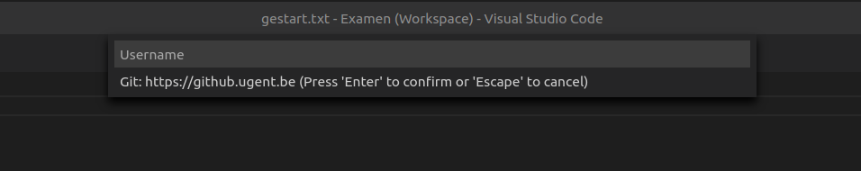
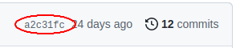

# Examen Systeemprogrammeren 03/02/2023

## VSCode extensies

Tijdens het examen is het gebruik van ondersteunende extensies, zoals bijvoorbeeld geavanceerde code completion, niet toegestaan. Dit zijn onder andere ook extensies die gebruikmaken van AI. Extensies zoals Copilot, ChatGPT,... mogen dus niet gebruikt worden. Verwijder deze extensies voor de aanvang van het examen. Uitschakelen is niet voldoende! Indien een dergelijke extensie geïnstalleerd is tijdens het examen (ook als je hier geen gebruik van maakt), staat dit gelijk aan fraude en resulteert dit in een 0 voor het examen. Daarnaast zal de examencommissie een beslissing nemen over de mogelijkheid tot slagen van andere vakken.

## Beginnen

1. Start een terminal.
1. Download de opgave repository. Geef je UGent gebruikersnaam (`bdmeuric`) en wachtwoord in wanneer dit gevraagd wordt.

   ```bash
   git clone https://github.ugent.be/sysprog-examen-2023-02/sysprog-examen-2023-02-bdmeuric.git
   ```

1. Open het examen in VSCode vanuit Ubuntu.

   **Belangrijk: Het examen dient geopend te worden met het `examen.code-workspace` bestand!**

   ```bash
   code sysprog-examen-2023-02-bdmeuric/examen.code-workspace
   ```

1. Kies "Yes, I trust the authors", zodat VSCode de regular mode gebruikt.

   

1. Open het bestand `gestart.txt`, verander `neen` in `ja` en sla de wijzigingen op ("File" > "Save").
1. Voer de taak "Start Examen" uit (in de bovenste menu "Terminal" > "Run Task..." en dan "start examen"). **Geef bovenaan het VSCode venster je UGent gebruikersnaam en wachtwoord in.**

   

   Dit dient de wijzigingen in het `gestart.txt` bestand in, en zal iedere tien minuten opnieuw alle wijzigingen indienen tot je de taak stopzet of VSCode afsluit.

   **Stop deze taak nooit tijdens het examen!**

1. Controleer op <https://github.ugent.be/sysprog-examen-2023-02/sysprog-examen-2023-02-bdmeuric.git> of het `gestart.txt` bestand aangepast is.

Tijdens het examen zullen de wijzigingen iedere tien minuten ingediend worden. Je kan dit zelf ook manueel doen door middel van de task "manueel indienen". Om zeker te zijn dat je geen git conflicten krijgt tijdens het examen mag je **git niet zelf gebruiken** tijdens het examen. Gebruik enkel de tasks om in te dienen.

## Opgave

De opgave staat beschreven in het bestand [`opgave.pdf`](./opgave.pdf).

## Indienen

1. Voer de task "manueel indienen" uit (via de menu bovenaan: "Terminal" > "Run Task..." en kies "manueel indienen").
1. Controleer op <https://github.ugent.be/sysprog-examen-2023-02/sysprog-examen-2023-02-bdmeuric.git> of alle wijzigingen doorgevoerd zijn.
1. Sluit VSCode af zodat het automatisch indienen stopt.

Vul na het indienen het tijdstip en hash van de laatste commit in op de examenopgave. De hash van jouw laatste commit vind je naast het aantal commits, een voorbeeld:

   


Als je jouw code op GitHub ziet staan dan heb je correct ingediend. Je kan zoveel indienen als je wilt. De laatst ingediende code zal verbeterd worden. Na het indienen mag je VSCode op je computer afsluiten. Bij het afsluiten zal het automatisch indienen ook gestopt worden.
